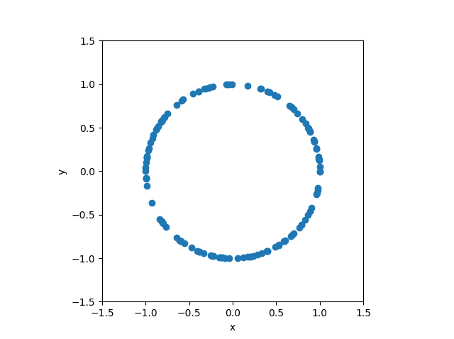
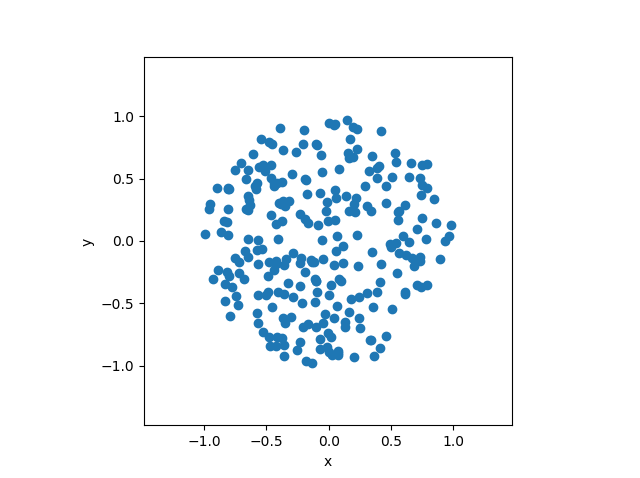
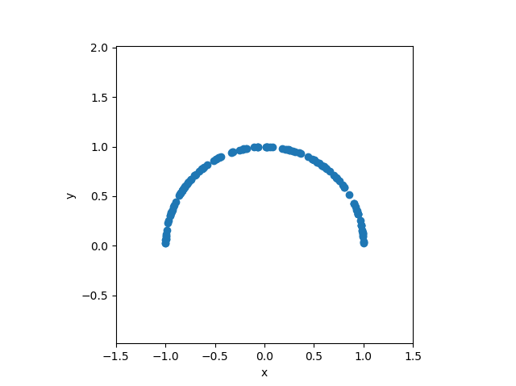
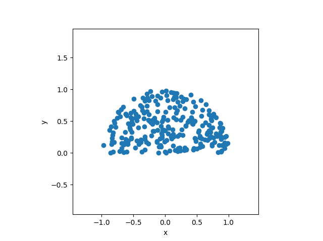
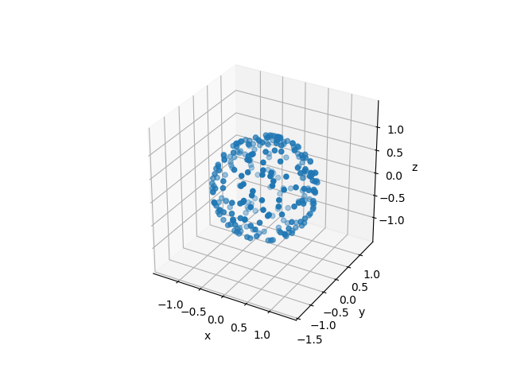
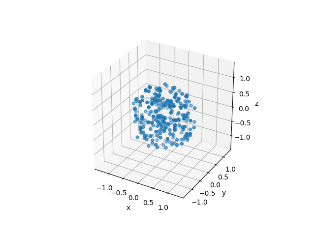
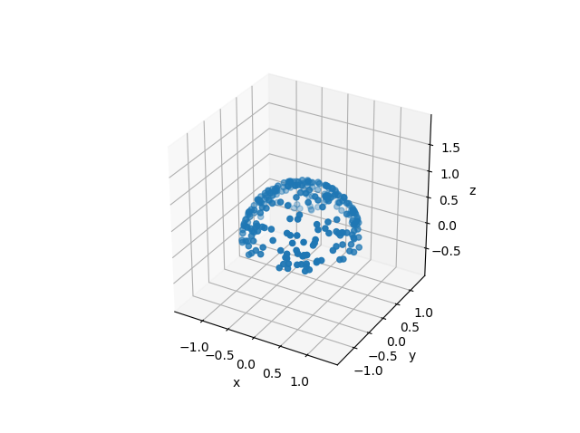
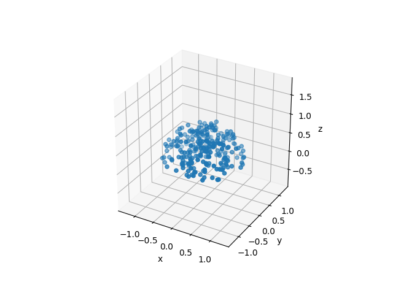
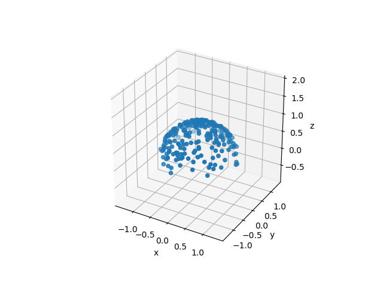

# sampy

## About
Sampling utilities. 
(See also: [Fibonacci spiral sampling (Quasi-Monte Carlo techniques) utilities](https://github.com/matt77hias/fibpy))

## Use

### Uniform sampling on/in unit circle
<p align="center">


</p>

### Uniform sampling on/in unit halfcircle
<p align="center">


</p>

### Uniform sampling on/in unit sphere
<p align="center">


</p>

### Uniform sampling on/in unit halfsphere
<p align="center">


</p>

### Cosine weighted sampling on unit hemisphere
<p align="center">

</p>

```python
# Code
test.test()
```
